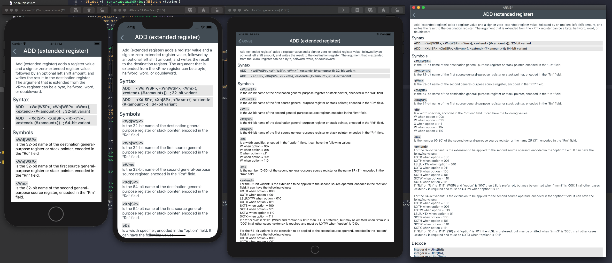

[1.1]: http://i.imgur.com/tXSoThF.png (twitter icon with padding)
[1]: http://www.twitter.com/jamiebishop123
[2]: http://www.twitter.com/evilpenguin_

# ARMRef 

An iOS, iPadOS, and macOS application reference manual for ARMv8

Required
----------
- iOS 13+
- iPadOS 13+
- macOS 10.15+

How to
----------
- Open ARMRef/ARMRef.xcodeproj
- Build and run :)

Shout-out
----------
- @jamiebishop123‬ [![alt text][1.1]][1]

Suggested
----------
- Enjoy :)
- Contribute!
- Follow me [![alt text][1.1]][2]

Screenshot
----------

